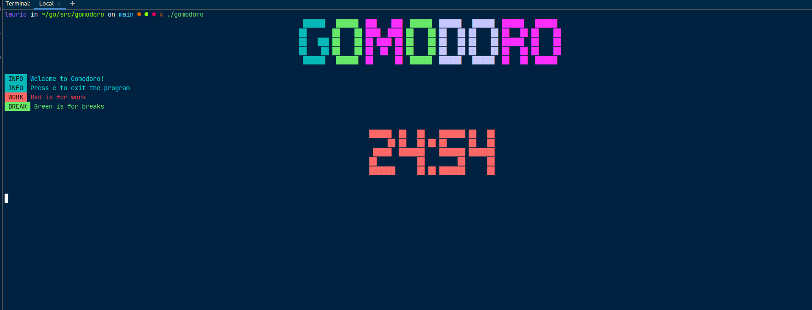

# Gomodoro
Simple CLI Pomodoro timer.  
The Pomodoro technique is a time management method that helps you to focus on your tasks.  
[See here for more info](https://en.wikipedia.org/wiki/Pomodoro_Technique).

## Installation

## Usage
Simply launch the app and start working. 
Default timer is set to 25 minutes working time, 5 minutes short breaks and 10 minutes long breaks.

Add flags to customize your work time, short breaks and long breaks:  
```
gomo -work=15 -short=2 -long=4
```

Hit "c" to stop the app, this will log your work session into a sessions.txt file.
```
09-08-2021 21:59:52
Number of sessions: 1
 Work time: 25 minutes
 Break time: 5 minutes
```


## Screenshots

***
### Used libraries
[Pterm](https://github.com/pterm/pterm#-examples) - A golang module to print pretty text  
[Notificator](https://github.com/0xAX/notificator) - Desktop notifications  
[Go-TTY](https://github.com/mattn/go-tty) - Simple tty utility  